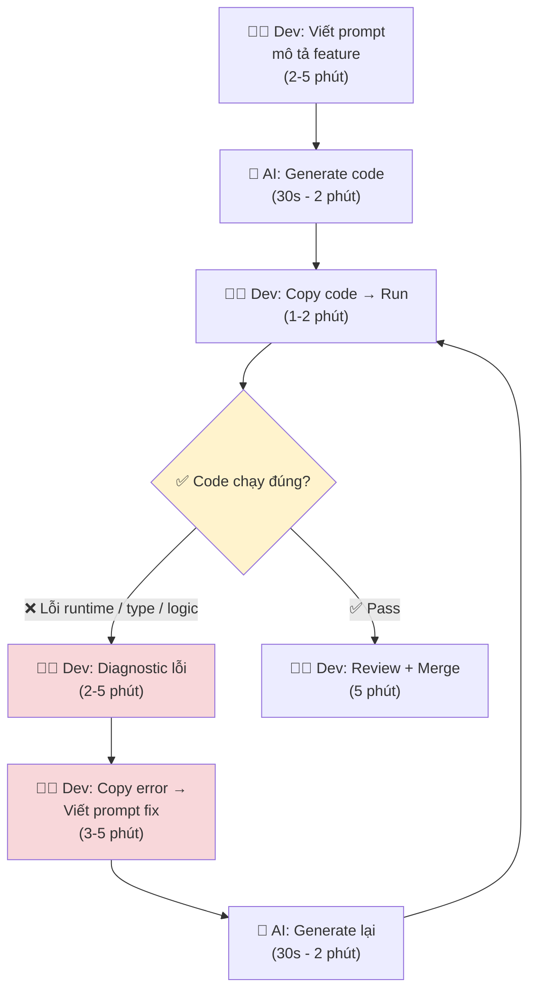

# Current Workflow — Card #1 Prompt-Debug Loop

## Thông số

| Metric | Giá trị | Ghi chú |
|---|---|---|
| Tổng bước | 7 bước | Không tính vòng lặp |
| Số lần loop trung bình | 3-5 lần/task | Task đơn giản: 1-2; phức tạp: 5-8 |
| Thời gian mỗi loop | 5-10 phút | Diagnostic + prompt + gen |
| Tổng thời gian/task | 60-90 phút | Có thể lên 2h với task lớn |
| Thời gian hữu ích | ~15 phút | Code đúng + review |
| Thời gian lãng phí | 45-75 phút | Loop debug |

## Bottleneck chính

**Bước 5-6: Dev copy error + viết prompt fix + chờ AI generate lại.**

Đây là điểm nghẽn vì:
- Dev bị ngắt flow (đang nghĩ về solution → phải chuyển sang diagnostic mode)
- Viết prompt fix yêu cầu đọc hiểu error message → thời gian cognitive
- Chờ AI generate lại (dù 30-60s) làm gãy mạch suy nghĩ
- Mỗi lần loop làm tăng frustration và giảm trust vào AI
