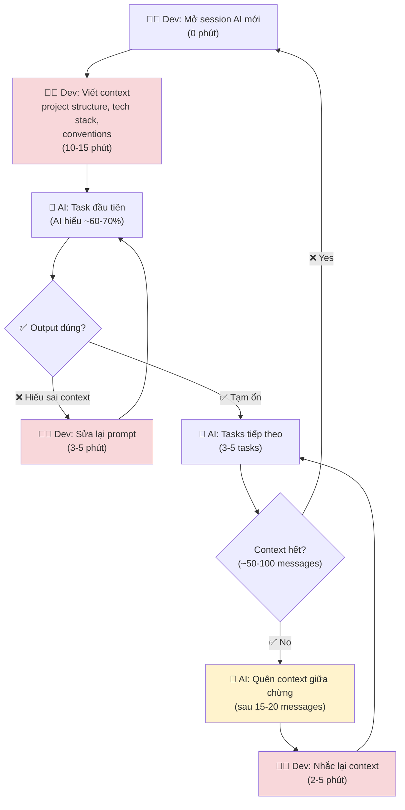

# Current Workflow — Card #2 Context Reset

## Thông số

| Metric | Giá trị | Ghi chú |
|---|---|---|
| Setup time/session mới | 10-15 phút | Viết context từ đầu |
| Nhắc lại giữa session | 2-5 phút/lần | Quên sau 15-20 messages |
| Số lần nhắc lại/session | 3-5 lần | ~3-5 lần mỗi session |
| Sessions/ngày | 3-5 session | Task sáng, trưa, chiều, tối |
| **Tổng thời gian lãng phí/ngày** | **45-75 phút** | 10-15 phút × 3-5 session |

## Bottleneck chính

**Bước 2: Viết context từ đầu.** Mỗi session mới không share context → phải lặp lại toàn bộ. Đây không chỉ là mất thời gian, mà còn là:
- **Cognitive load**: phải nhớ project có những gì để viết lại
- **Inconsistency**: mỗi lần viết khác nhau → AI hiểu khác nhau
- **Frustration**: vibe coding mất flow vì phải chờ AI "warm up"
