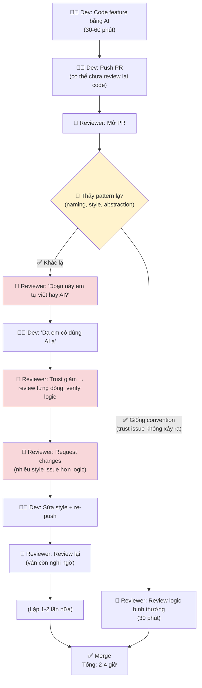

# Current Workflow — Card #3 AI Code Trust Issue

## Thông số

| Metric | Code thường | AI code (trust issue) | Ghi chú | Source |
|---|---|---|---|---|
| Review time/PR | 30 phút | ~42 phút (+40%) | Trust issue → verify everything | ACM ICSE 2024 |
| Số vòng review | 1-2 | 2-3 | Fix style + re-review | Estimate |
| Style comments/PR | baseline | +60% | Nhiều style comment hơn logic | GitClear 2025 |
| Trust score | 4.1/5 | 3.2/5 | Gap 0.9 điểm | Google Research 2024 |
| Team friction | Thấp | Trung bình | "Bị đối xử khác" | Estimate |

## Bottleneck chính

**Bước G: Reviewer trust giảm → review từng dòng.** 

Đây là bottleneck vì:
- Reviewer chuyển từ mental model "trust but verify" sang "verify everything"
- Mỗi dòng code được kiểm tra với độ suspicious cao hơn
- Style issue (AI viết khác convention) được ưu tiên hơn logic issue
- Kết quả: review mất 2-3x thời gian, nhiều comment vô ích

## Nguyên nhân gốc

Không phải AI code quality kém (dù có thể), mà là:
1. **AI code style khác human** — dù đúng logic vẫn bị review vì style
2. **Trust asymmetry** — code do người viết được trust mặc định; code AI phải chứng minh
3. **Thiếu convention** — không có chuẩn để đo AI code có "match" hay không
4. **Thiếu process** — không có quy định xử lý AI code trong review
