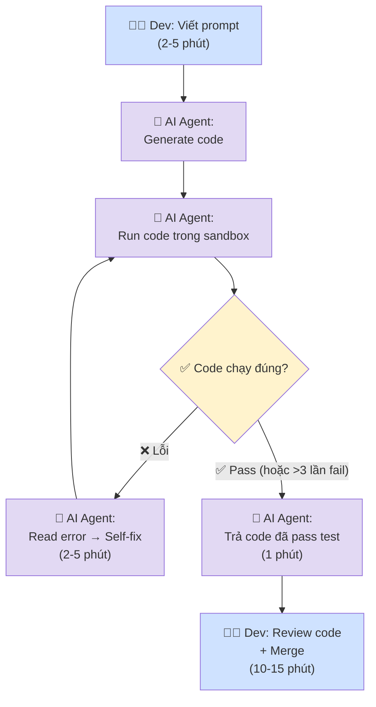

# Future Workflow — Card #1 Prompt-Debug Loop

## Nguyên lý: AI tự động loop debug trong sandbox

AI generate code → tự run test → detect lỗi → tự sửa → re-run → chỉ trả code đã pass cho dev.



## Thông số

| Metric | Trước | Sau kỳ vọng | Ghi chú |
|---|---|---|---|
| Số lần loop thủ công/task | 3-5 lần | 0 lần | AI tự loop internally |
| Tổng thời gian/task | 60-90 phút | 20-30 phút | Giảm 60-70% |
| Thời gian dev active | 45-60 phút | 15-20 phút | Dev chỉ prompt + review |
| Số lần ngắt flow/task | 5-7 lần | 1-2 lần | Chỉ ngắt ở prompt + review |
| AI self-fix rate | 0% | >70% | AI tự fix pass được trong ≤3 lần |

## Fallback

```
AI loop >3 lần không pass → 
  → Báo dev: "Code chưa pass test X. Error: ..."
  → Dev handle thủ công (như workflow cũ)

Logic error (code chạy nhưng sai kết quả):
  → AI không tự detect được → dev phát hiện → fix prompt / tự sửa
  → Không nằm trong scope AI loop
```

## Scope của AI loop

| Loại lỗi | AI detect? | AI tự fix? | Scope |
|---|---|---|---|
| Compile error (syntax, type, import) | ✅ Tốt | ✅ Tốt | Trong scope |
| Runtime error (exception, crash) | ✅ Tốt | ✅ Tốt | Trong scope |
| Logic error (sai kết quả, sai business rule) | ❌ Yếu | ❌ Yếu | Ngoài scope → dev |
| Style/convention issue | ⚠️ Trung bình | ✅ Tốt | Optional |

## Human boundary

- **Dev viết prompt** — vẫn là human decision: feature requirement, business logic
- **Dev review code cuối** — bắt buộc: AI có thể pass test nhưng sai logic hoặc không match convention
- **AI tự loop debug** — trong sandbox, không ảnh hưởng production

## Risk & mitigation

| Risk | Mitigation |
|---|---|
| AI loop vô hạn | Giới hạn 3 lần, sau đó fallback cho dev |
| AI sửa lỗi nhưng tạo bug mới | Dev review final code |
| Sandbox không cover hết edge case | Dev vẫn chạy test manual trước merge |
| AI tốn token/chi phí cho loop internal | So sánh cost trade-off vs dev time saved |
| Logic error AI không detect | Dev tự detect (khoảng 20-30% lỗi) |

## Cost analysis

| Item | AI loop internal | Dev loop thủ công |
|---|---|---|
| **Cost/lần** | ~$0.01-0.04 (500-2000 tokens) | ~$1-3 (5-10 phút × ~$15-20/h) |
| **Speed** | 30-60 giây/lần | 5-10 phút/lần |
| **Break-even** | 100 lần AI = 1 lần dev | — |
| **Quality** | Chỉ fix compile/runtime | Fix cả logic |
| **Kết luận** | AI loop rẻ hơn ~100x về cost | Dev loop cần cho logic error |
