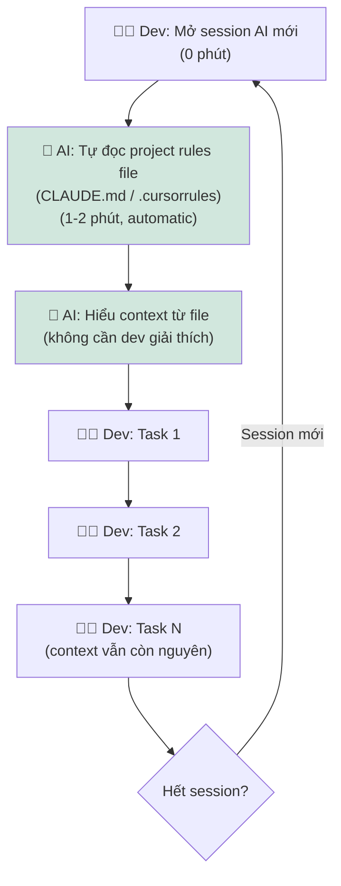

# Future Workflow — Card #2 Context Reset

## Nguyên lý: Rule file (CLAUDE.md / .cursorrules) tự động load



## Thông số

| Metric | Trước | Sau kỳ vọng | Ghi chú |
|---|---|---|---|
| Setup time/session | 10-15 phút | 1-2 phút | AI tự đọc rules file |
| Nhắc lại context/session | 3-5 lần | 0 lần | Rules file giữ context |
| AI correct-first-attempt | ~60% | >85% | Nhờ context rõ ngay từ đầu |
| Thời gian lãng phí/ngày | 45-75 phút | <10 phút | |
| Dev frustration | Cao | Thấp | Không phải giải thích lại |

## Fallback

```
Nếu rules file chưa đủ → Dev viết thêm context trong prompt đầu tiên
(1-2 phút thay vì 10-15 phút)
```

## Human boundary

- Dev vẫn phải maintain rules file (cập nhật khi project thay đổi)
- Dev vẫn quyết định task cần làm — AI chỉ biết context, không tự quyết định

## Risk & mitigation

| Risk | Mitigation |
|---|---|
| Rules file outdated → AI hiểu sai context | Dev update rules file khi project thay đổi (5 phút/tuần) |
| AI không support rules file | Dùng context paste template thay thế (vẫn nhanh hơn viết từ đầu) |
| Rules file quá dài → AI ignore | Giữ rules file < 200 tokens, chỉ ghi essentials |
