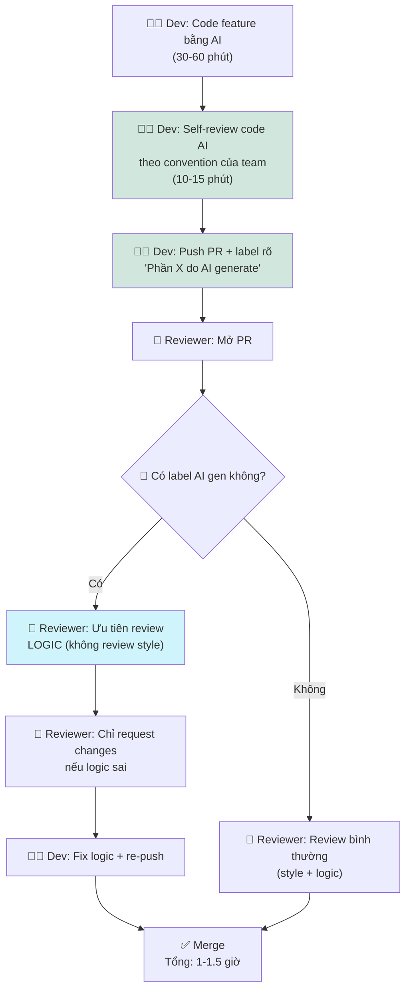

# Future Workflow — Card #3 AI Code Trust Issue

## Nguyên lý: Convention + Label — ai cũng biết code nào từ AI và đánh giá đúng mức



## Thông số

| Metric | Trước | Sau kỳ vọng | Ghi chú |
|---|---|---|---|
| Review time/PR | 60-120 phút | 30-45 phút | Chỉ review logic cho AI code |
| Số vòng review | 3-4 | 1-2 | Giảm style-related cycles |
| Số comment/PR | 15-25 | 5-10 | Chỉ comment logic |
| Team friction | Cao | Thấp | Convention rõ → trust rõ |
| Dev tự review | Không bắt buộc | Bắt buộc | Dev phải self-review AI output |

## Fallback

```
Không label AI gen → reviewer mặc định review bình thường (style + logic).
Label sai = trust issue nghiêm trọng hơn.
```

## Human boundary

- Dev phải self-review AI output trước push (bắt buộc)
- Reviewer vẫn review logic (AI có thể sai logic dù pass test)
- Convention team phải được thống nhất trước, không áp đặt

## Risk & mitigation

| Risk | Mitigation |
|---|---|
| Dev lợi dụng label → không review AI output | Policy: label AI = dev đã review. Nếu bug do AI → dev chịu trách nhiệm |
| Reviewer vẫn review style dù có label | Training reviewer: focus logic, ignore style cho AI code |
| Team có convention khác nhau | Thống nhất convention trong PR template |
