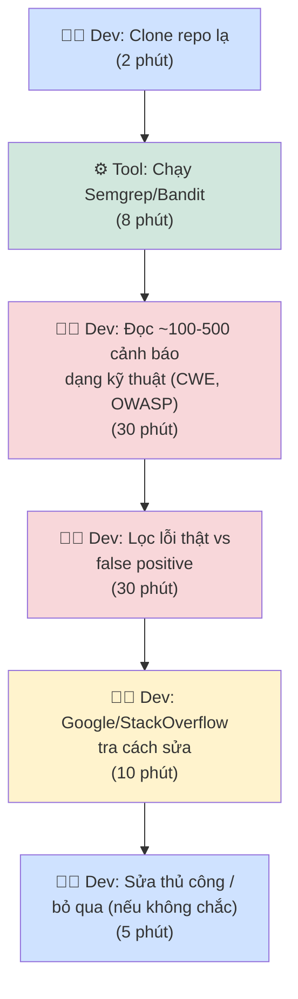
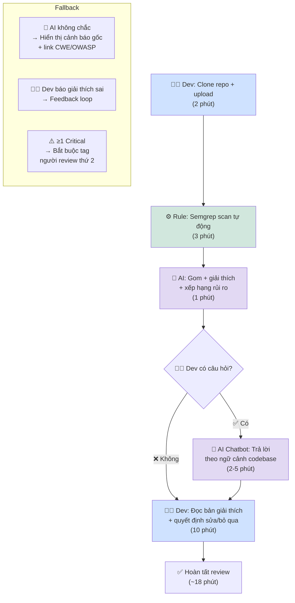

# Workflow — AI-Assisted Security Repository Review

> File phụ cho `02-group-problem-statement.md`
> Mermaid diagram cho current và future workflow

---

## Current Workflow (Before)



### Thông số hiện tại

| Metric | Giá trị | Ghi chú |
|---|---|---|
| Tổng thời gian | ~75 phút/repo | Clone → scan → đọc → lọc → Google → sửa |
| Bottleneck | Bước 3+4 (đọc + lọc): ~60 phút | 75% tổng thời gian |
| Số lượng cảnh báo | 100-500 warnings/repo | Semgrep mặc định ruleset |
| Tỉ lệ false positive | ~30-50% | Tùy ruleset và codebase |
| Lỗi Critical bị bỏ sót | Không đo — nhưng có risk | Dev không chuyên thường bỏ qua không cố ý |

---

## Future Workflow (After)



### Thông số kỳ vọng

| Metric | Trước | Sau | Giảm |
|---|---:|---:|---:|
| Tổng thời gian | ~75 phút | ~18 phút | **~76%** |
| Số bước thủ công (dev) | 5/6 | 3/5 | 40% |
| Bottleneck | Đọc + lọc (60') | Dev đọc giải thích (10') | Human boundary |
| Số lần Google/StackOverflow | 5-10 lần | 0-2 lần | **~80%** |
| Lỗi Critical bị bỏ sót | Có risk | ~0 (với AI hỗ trợ) | Mục tiêu |

---

## Fallback & Boundary

### Fallback mechanisms

```text
1. AI không chắc về lỗ hổng
   → Không tự đoán. Hiển thị cảnh báo gốc + link CWE/OWASP.

2. Dev báo giải thích sai
   → Feedback loop: gửi về để cải thiện RAG corpus.
   → Nếu >2 lỗi Critical sai trong 3 lần chạy → dừng pilot.

3. Alert ≥1 Critical severity
   → Bắt buộc tag người review thứ 2 (không để 1 dev tự quyết định).

4. Token cost >$1/repo
   → Chỉ scan critical files (không scan node_modules, test, docs).
```

### Human boundary

```text
AI được phép:      Giải thích cảnh báo, xếp hạng rủi ro, 
                   gợi ý cách sửa (code mẫu tham khảo)

AI không được phép: Tự sửa code lên repo
                    Tự quyết định false positive
                    Tự bịa lỗ hổng không có trong scan results
                    Check infrastructure security (OS, network)
                    Tự động merge PR
```

---

*Workflow file — Nhóm 16 — Day 02 Lab*
